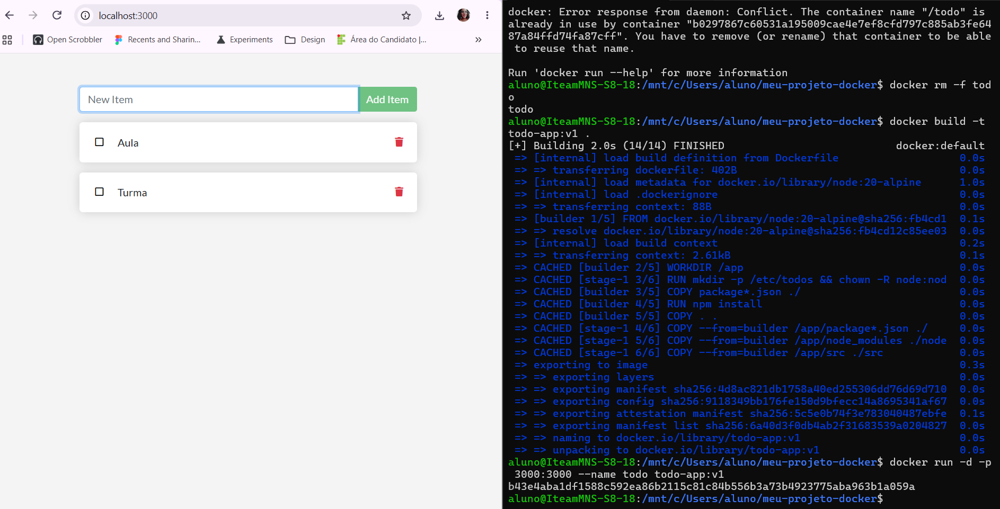
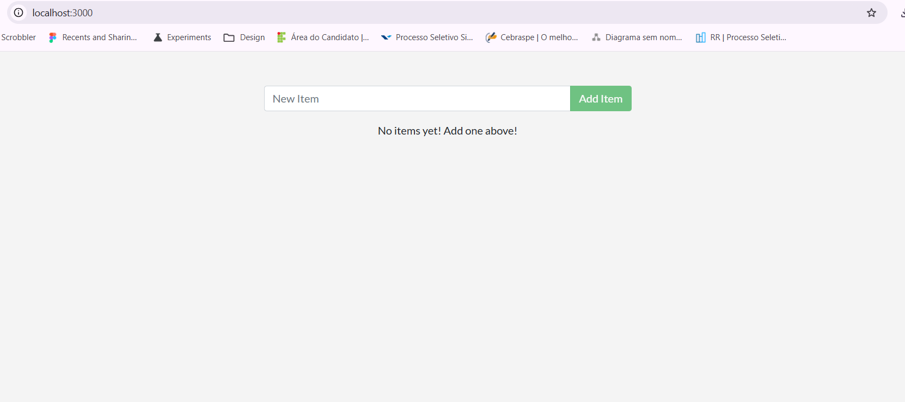
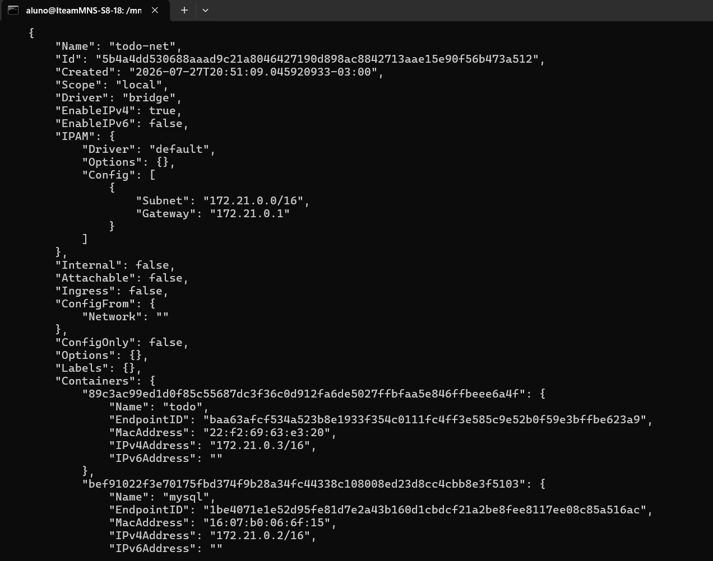
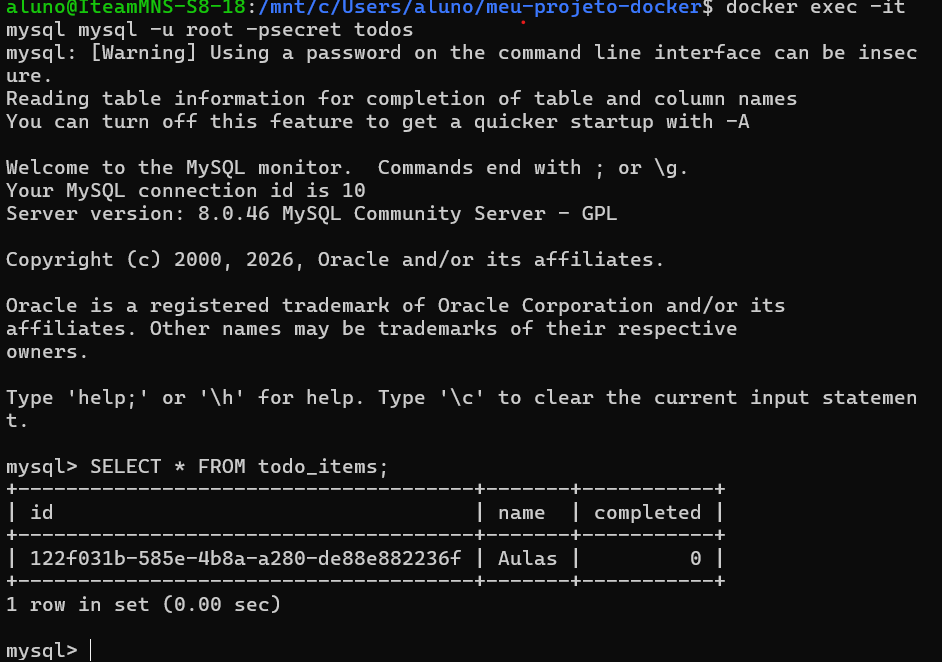
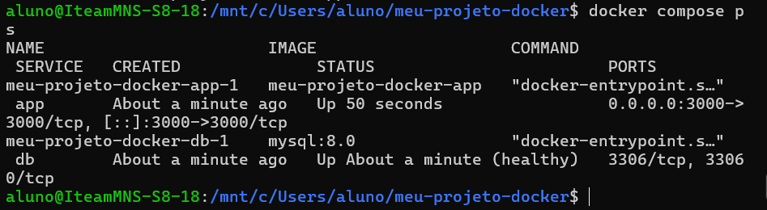
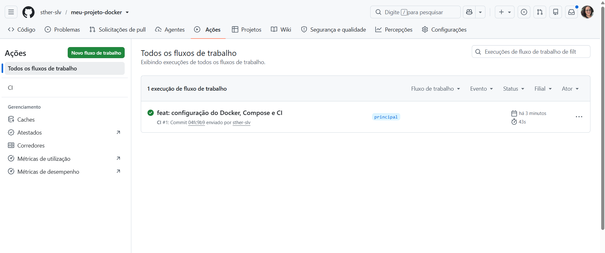
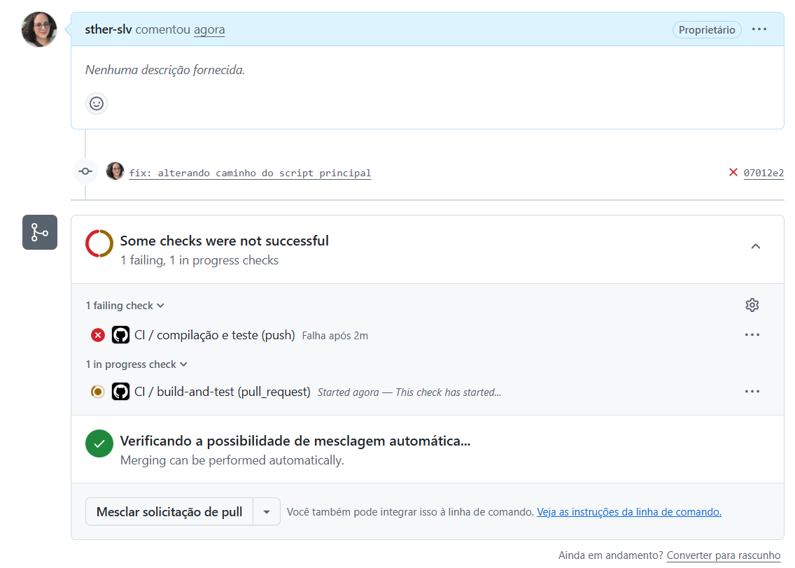

# Atividade Prática - Docker + Compose + CI

**Aluno(a):** Stephany Silva
**Repositório:** [https://github.com/sther-slv/meu-projeto-docker](https://github.com/sther-slv/meu-projeto-docker)

---

## 📌 Descrição do Projeto
Este projeto consiste no empacotamento em containers da aplicação de tarefas To-Do (Node.js), utilizando Docker, Docker Compose para orquestração com MySQL, e uma esteira de integração contínua (CI) com GitHub Actions.

---

## 🚀 Parte 1 - Dockerfile Multi-Stage e Imagem Final

Foi utilizado um Dockerfile com **multi-stage build** para isolar as dependências de compilação da imagem final, mantendo a aplicação segura (executada com usuário não-root `node`) e enxuta.

> **Por que o multi-stage ajuda no tamanho e na segurança da imagem?**
> O multi-stage build permite separar o ambiente de instalação/build do ambiente de execução final. Com isso, ferramentas de compilação e arquivos desnecessários não são levados para a imagem final, reduzindo drasticamente o seu tamanho e diminuindo a superfície de ataque para eventuais vulnerabilidades de segurança.

### Evidências da Parte 1:
* **Tamanho da Imagem Gerada:**
  

* **Aplicação Rodando no Navegador:**
  

---

## 💾 Parte 2 - Volumes e Persistência de Dados

Demonstração do comportamento da aplicação em relação à persistência de dados em containers avulsos (utilizando SQLite).

### Evidências da Parte 2:
* **Sem Volume (Perda de dados ao recriar o container):**
  

* **Com Volume Nomeado (Dados mantidos intactos):**
  

---

## 🌐 Parte 3 - Redes e Comunicação de Containers

Criação da rede `todo-net` para comunicação interna entre o container da aplicação Node.js e o banco de dados MySQL sem expor a porta do banco ao host.

> **Por que o app consegue chamar o host `mysql` sem saber o IP dele?**
> Ao conectar os containers em uma rede customizada do Docker (`todo-net`), o serviço de DNS interno embutido do Docker resolve automaticamente o alias ou nome do container (`mysql`) para o IP dinâmico correto na rede.

### Evidências da Parte 3:
* **Inspeção da Rede (`docker network inspect`):**
  

* **Consulta SQL no MySQL (`SELECT * FROM todo_items;`):**
  

---

## 🐙 Parte 4 - Docker Compose

Orquestração completa dos serviços `app` e `db` utilizando o `compose.yaml`, com variáveis de ambiente isoladas em arquivo `.env` e suporte a `healthcheck`.

> **Diferença entre `docker compose down` e `docker compose down -v`:**
> O comando `docker compose down` encerra e remove apenas os containers e redes criados pela stack, mantendo os volumes salvos. Já o `docker compose down -v` remove também os volumes nomeados associados, apagando permanentemente todos os dados gravados.

### Evidência da Parte 4:
* **Status dos Serviços (`docker compose ps`):**
  

---

## 🚀 Parte 5 & 6 - CI com GitHub Actions e Demonstração de Falha

Criação de um workflow de CI (`.github/workflows/ci.yml`) que valida o arquivo de compose, constrói a imagem, sobe a stack e realiza um smoke test no endpoint da API.

> **Relato da Quebra Proposital do CI:**
> Para demonstrar a atuação do CI na detecção de erros, alterei o comando de inicialização no `Dockerfile` apontando para um script inexistente (`src/indexx.js`). O pipeline de CI detectou a falha no momento do smoke test, já que a aplicação não conseguiu subir na porta 3000. Analisando os logs expostos no job do GitHub Actions, identificamos que o arquivo de entrada do Node não foi localizado, permitindo corrigir o caminho e reverter o pipeline para o status verde.
>
> Respostas
O que é o Docker Hub?
É um registro público e remoto de imagens Docker na nuvem (análogo ao GitHub para código). Ele permite armazenar, versionar, distribuir e compartilhar imagens de containers prontas para execução em qualquer ambiente.

Diferença entre CI e CD:
O CI (Continuous Integration) foca na validação do código, automatizando builds e testes a cada envio para garantir estabilidade. O CD (Continuous Delivery/Deployment) assume após o CI ser aprovado, automatizando o empacotamento e a entrega contínua dos artefatos finais (a imagem Docker) na prateleira/registro para uso final.

Por que usar token e Secrets em vez de escrever usuário e senha não cd.yml?
Por segurança[citar: 1]. Escrever credenciais diretamente em um arquivo do repositório expõe sua senha publicamente no Git. Os Segredos funcionam como um cofre criptografado e o Token de Acesso Pessoal concedem uma autorização com escopo limitado que pode ser revogada sem alterar a senha principal da conta.

O que significa uma tag latest?
Indica a versão padrão e mais recente ( última compilação ) publicada de uma imagem em um repositório. Ela aponta automaticamente para a última build gerada na branch principal quando nenhuma tag numérica de versão é especificada.

✅ Checklist de Entrega
Repositório público no GitHub com histórico de commits (sem commit único "final")
 Dockerfilefuncional multiestágios +.dockerignore
 compose.yamlcom rede, volume nomeado, variáveis ​​de ambiente ehealthcheck
 .env.exampleversionado e .envignorado
Fluxo de trabalho do GitHub Actions em execução
Um PR com o CI vermelho e depois verde (histórico visível)
Workflow de CD ( cd.yml) configurado e publicado no Docker Hub
Segredos DOCKERHUB_USERNAMEeDOCKERHUB_TOKEN​
README preenchido com todos os prints pedidos e as respostas das perguntas.
Link do repositório enviado ao professor.

### Evidências das Partes 5 e 6:
* **Pipeline Integrado e Verde:**
  

* **Pipeline com Falha Detectada (PR Vermelho) + Logs do Erro:**
  
