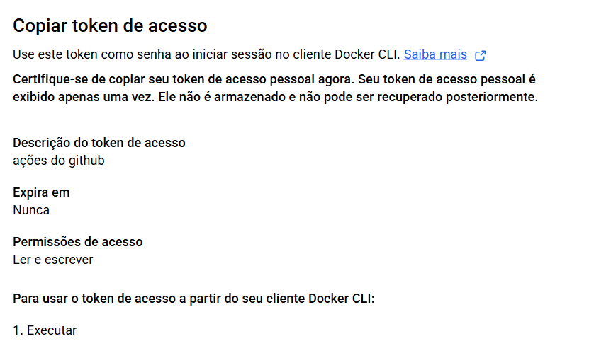
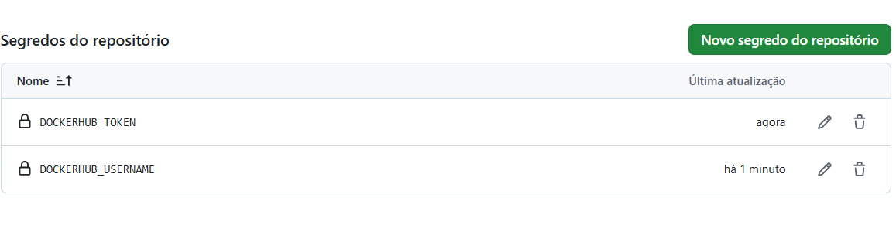
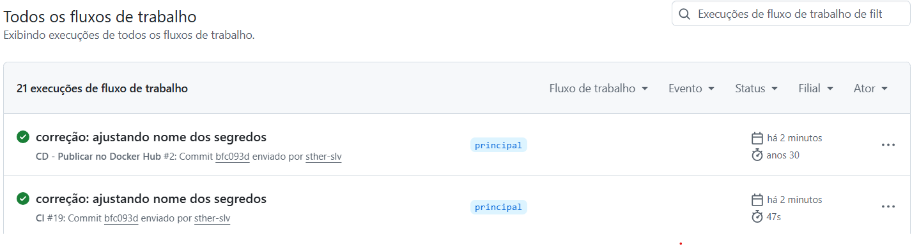
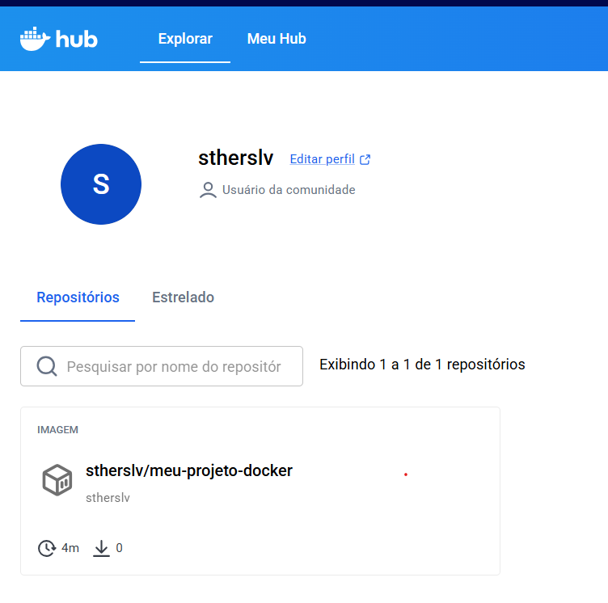

# Atividade Prática - Docker + Compose + CI

**Aluno(a):** Stephany Silva
**Repositório:** [https://github.com/sther-slv/meu-projeto-docker](https://github.com/sther-slv/meu-projeto-docker)

---

## 📌 Descrição do Projeto
Este projeto consiste no empacotamento em containers da aplicação de tarefas To-Do (Node.js), utilizando Docker, Docker Compose para orquestração com MySQL, e uma esteira de integração contínua (CI) com GitHub Actions.

---

## 🚀 Parte 1 - Dockerfile Multi-Stage e Imagem Final

Foi utilizado um Dockerfile com **multi-stage build** para isolar as dependências de compilação da imagem final, mantendo a aplicação segura (executada com usuário não-root `node`) e enxuta.

> **Por que o multi-stage ajuda no tamanho e na segurança da imagem?**
> O multi-stage build permite separar o ambiente de instalação/build do ambiente de execução final. Com isso, ferramentas de compilação e arquivos desnecessários não são levados para a imagem final, reduzindo drasticamente o seu tamanho e diminuindo a superfície de ataque para eventuais vulnerabilidades de segurança.

### Evidências da Parte 1:
* **Tamanho da Imagem Gerada:**
  

* **Aplicação Rodando no Navegador:**
  

---

## 💾 Parte 2 - Volumes e Persistência de Dados

Demonstração do comportamento da aplicação em relação à persistência de dados em containers avulsos (utilizando SQLite).

### Evidências da Parte 2:
* **Sem Volume (Perda de dados ao recriar o container):**
  

* **Com Volume Nomeado (Dados mantidos intactos):**
  

---

## 🌐 Parte 3 - Redes e Comunicação de Containers

Criação da rede `todo-net` para comunicação interna entre o container da aplicação Node.js e o banco de dados MySQL sem expor a porta do banco ao host.

> **Por que o app consegue chamar o host `mysql` sem saber o IP dele?**
> Ao conectar os containers em uma rede customizada do Docker (`todo-net`), o serviço de DNS interno embutido do Docker resolve automaticamente o alias ou nome do container (`mysql`) para o IP dinâmico correto na rede.

### Evidências da Parte 3:
* **Inspeção da Rede (`docker network inspect`):**
  

* **Consulta SQL no MySQL (`SELECT * FROM todo_items;`):**
  

---

## 🐙 Parte 4 - Docker Compose

Orquestração completa dos serviços `app` e `db` utilizando o `compose.yaml`, com variáveis de ambiente isoladas em arquivo `.env` e suporte a `healthcheck`.

> **Diferença entre `docker compose down` e `docker compose down -v`:**
> O comando `docker compose down` encerra e remove apenas os containers e redes criados pela stack, mantendo os volumes salvos. Já o `docker compose down -v` remove também os volumes nomeados associados, apagando permanentemente todos os dados gravados.

### Evidência da Parte 4:
* **Status dos Serviços (`docker compose ps`):**
  

---

## 🚀 Parte 5 & 6 - CI com GitHub Actions e Demonstração de Falha

Criação de um workflow de CI (`.github/workflows/ci.yml`) que valida o arquivo de compose, constrói a imagem, sobe a stack e realiza um smoke test no endpoint da API.

> **Relato da Quebra Proposital do CI:**
> Para demonstrar a atuação do CI na detecção de erros, alterei o comando de inicialização no `Dockerfile` apontando para um script inexistente (`src/indexx.js`). O pipeline de CI detectou a falha no momento do smoke test, já que a aplicação não conseguiu subir na porta 3000. Analisando os logs expostos no job do GitHub Actions, identificamos que o arquivo de entrada do Node não foi localizado, permitindo corrigir o caminho e reverter o pipeline para o status verde.

### Evidências das Partes 5 e 6:
* **Pipeline Integrado e Verde:**
  

* **Pipeline com Falha Detectada (PR Vermelho) + Logs do Erro:**
  

## 🚀 Entrega Contínua (CD) - Publicação no Docker Hub

Nesta etapa foi configurado o pipeline de **CD (Continuous Delivery)** usando o GitHub Actions. A cada *push* realizado na branch `main`, a imagem Docker da aplicação é construída automaticamente e enviada para o repositório público no Docker Hub.

---

### 📷 Evidências do Processo

#### 1. Token de Acesso Criado no Docker Hub
*Token de acesso (Personal Access Token) gerado com permissões de leitura e escrita para autenticação do GitHub Actions.*

---

#### 2. Secrets Cadastrados no GitHub
*Configuração das variáveis de ambiente (`DOCKERHUB_USERNAME` e `DOCKERHUB_TOKEN`) cadastradas com segurança no cofre do GitHub.*

---

#### 3. Execução do Pipeline de CD (GitHub Actions)
*Workflow `CD - Publicar no Docker Hub` finalizado com sucesso após a execução dos passos do arquivo `cd.yml`.*

---

#### 4. Imagem Publicada no Docker Hub
*Repositório público criado e atualizado no Docker Hub contendo a tag `latest` da aplicação.*

---

#### 5. Prova de Funcionamento (`docker pull`)
*Download e execução local da imagem baixada diretamente do repositório remoto do Docker Hub.*

### ❓ Perguntas e Respostas

1. **O que é o Docker Hub, na sua visão?**
   O Docker Hub é um registro público na nuvem para armazenamento e compartilhamento de imagens Docker. Ele funciona de forma semelhante ao GitHub, mas em vez de armazenar código-fonte, armazena pacotes e aplicações prontas em formato de contêiner para que qualquer pessoa consiga baixá-las e rodá-las facilmente.

2. **Qual a diferença entre o CI (atividade anterior) e o CD (esta)?**
   O **CI (Integração Contínua)** foca na validação e qualidade do código, executando testes e verificações automatizadas a cada novo *push*. Já o **CD (Entrega Contínua)** entra em ação após a aprovação do código para construir o pacote final (a imagem Docker) e publicá-lo automaticamente no ambiente de destino (Docker Hub).

3. **Por que usamos um token e Secrets em vez de escrever o usuário e a senha no arquivo `cd.yml`?**
   Por razões de segurança. O arquivo `cd.yml` fica visível no histórico do repositório, e expor credenciais nele permitiria o acesso não autorizado à conta do Docker Hub. O uso dos **Secrets** criptografa os dados sensíveis no GitHub, e o **Token** é uma chave revogável que limita o acesso apenas ao necessário, sem expor a senha principal.

4. **O que significa a tag `latest` no endereço da imagem?**
   A tag `latest` é uma etiqueta padrão que sinaliza qual é a versão mais recente e atualizada da imagem Docker disponível naquele repositório.